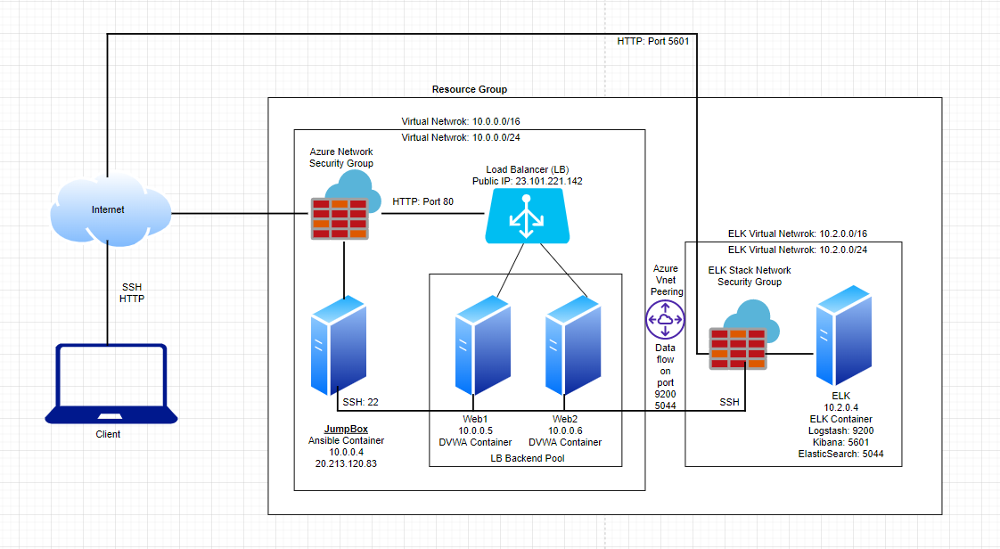

# ELK Stack Deployment

The files in this repository were used to configure the network depicted below.
### Cloud Network Diagram

These files have been tested and used to generate a live ELK deployment on Azure. These can be used to either recreate the entire deployment as pictured above. Alternatively, select portions of the playbook files may be used to install only certain pieces of it, such as Ansible Container, Filebeat and Metricbeat.

- [install-elk.yml](Ansible/filebeat-playbook.yml.txt)
- [filebeat-playbook.yml](Ansible/filebeat-playbook.yml.txt)
- [metricbeat-playbook.yml](Ansible/metricbeat-playbook.yml.txt)

## Description
The purpose of this network is to expose a loadbalance and monitored instance of DVWA a Volunerable web application. Load balancer ensure that the application is available by checking its health probes. If Web1 server is down it automatically switch to Web2
ELK server monitor the vulnerable VMs for changes to the log data and system metrics.

The configuration details of each virtual machine is as below.

| Name     | Function | IP Address | Operating System |
|----------|----------|------------|------------------|
| JumpBox  | JumpBox      | 10.0.0.4 | Linux            |
| Web1     | Web Server 1 | 10.0.0.5 | Linux            |
| Web2     | Web Server 2 | 10.0.0.6 | Linux            |
| ELK Stack| ELK Stack    | 10.2.0.4 | Linux            |

## Access Policies
The virtual machine (VMs) on internal network VNET are not exposed to the public, Web1 and Web2 are behind firewall.
JumpBox VM machine only can accept connections from the Internet on port 22, is only allowed from dedicated client IP addresses.
All other VMs e.g. Web1, Web2 and ELK server can only be accessed by Ansible Docker Container at JumpBox.

A summary of the access policies in Network Security Group (NSG) at Azure

| Name     | Publicly Accessible | Allowed IP Addresses |
|----------|---------------------|----------------------|
| JumpBox   | Yes                 | Public Home IP      |
| ELK Stack | No                  | JumpBox 			|
| Web1      | No                  | JumpBox 			|
| Web2      | No                  | JumpBox 			|

## Elk Configuration

Ansible was used to automate configuration of the ELK machine. No configuration was performed manually, which is advantageous because...
 1. The main advantage of automating the installation process is that you can deploy multiple servers quickly and easily without having to manually configure each server.

The playbook implements the following tasks:
1. Configures the machine with Docker.
2. Installs Docker.io and pip3.
3. Downloads and configures ELK docker container.
4. Activates ports 5601, 9200, and 5044.

The following screenshot displays the result of running `docker ps` after successfully configuring the ELK instance.

## Target Machines & Beats
This ELK server is configured to monitor the following machines:
1. Web-1 10.0.0.6
2. Web-2 10.0.0.5

We have installed the following Beats on these machines:
1. Filebeat
2. Metricbeat

These Beats allow us to collect the following information from each machine:
1. Filebeat watches for log files/locations and collects events related to those files and locations. 
2. Metricbeat records metrics and statistical data from the operating system and services that are running on the server.

## Using the Playbook
In order to use the playbook, you will need to have an Ansible control node already configured. Assuming you have such a control node provisioned: 

SSH into the control node and follow the steps below:
- Copy the install_elk_yml file to your /etc/ansible directory.
- Update the host file to include the IP Addresses of your Web-1, Web-2, and ELK server as well as assign python3 as the interpreter.
- Run the playbook, and navigate to your ELK server to check that the installation worked as expected.

Navigate to http://publicip(elkserver):5601 to check that the installation worked as expected. 