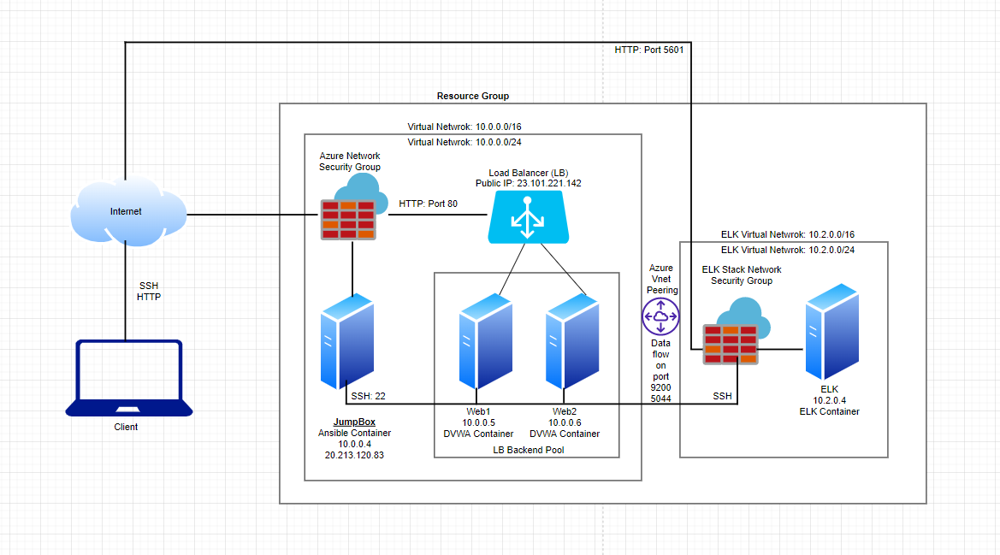
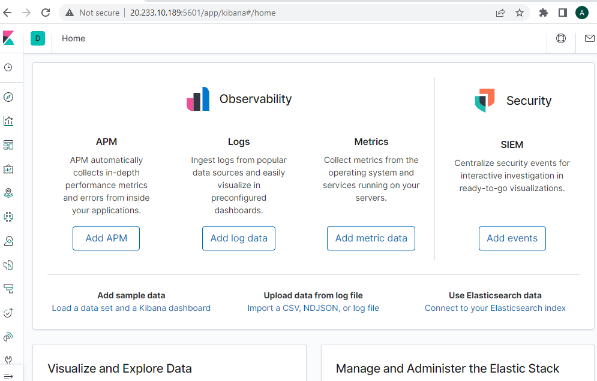
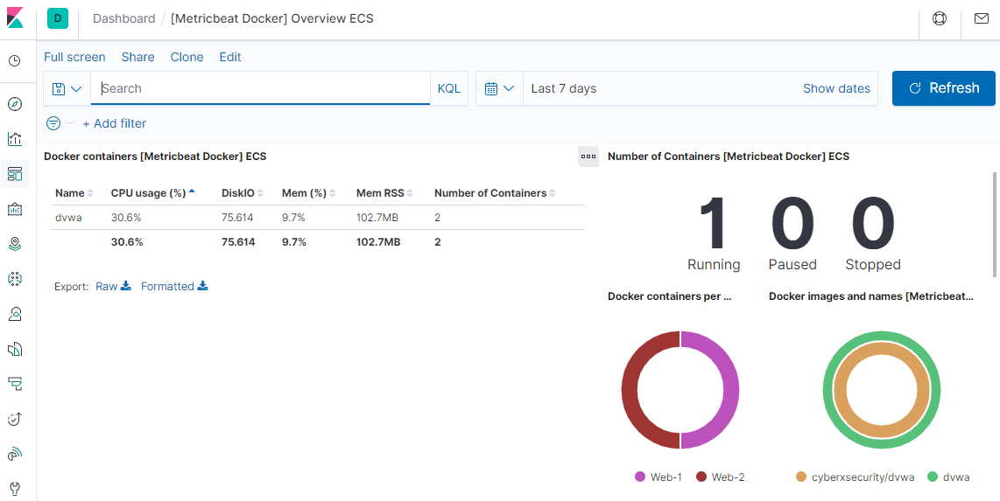
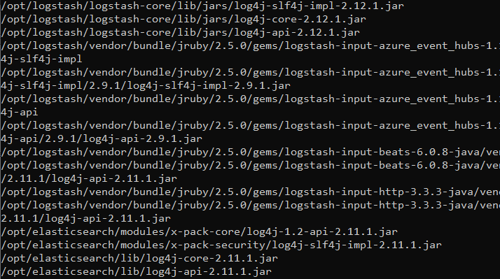

# ELK Stack Deployment - Project 1

- Description
- Access Policies
- ELK Configuration
- Target VMs & Beats
- Using the Playbook
- Kibana LOG4J Vulnerability

The files in this repository were used to configure the network depicted below.
### Cloud Network Diagram

These files have been tested and used to generate a live ELK deployment on Azure. These can be used to either recreate the entire deployment as pictured above. Alternatively, select portions of the playbook files may be used to install only certain pieces of it, such as Ansible Container, Filebeat and Metricbeat.

- [install-elk.yml](Ansible/filebeat-playbook.yml)
- [filebeat-playbook.yml](Ansible/roles/filebeat-playbook.yml)
- [filebeat-config.yml](Ansible/files/filebeat-config.yml)
- [metricbeat-playbook.yml](Ansible/roles/metricbeat-playbook.yml)
- [metricbeat-config.yml](Ansible/files/metricbeat-config.yml)

## Description
The purpose of this network is to expose a loadbalance and monitored instance of DVWA a Volunerable web application. Load balancer ensure that the application is available by checking its health probes. If Web1 server is down it automatically switch to Web2
ELK server monitor the vulnerable VMs for changes to the log data and system metrics.

The configuration details of each virtual machine is as below.

| Name     | Function | IP Address | Operating System |
|----------|----------|------------|------------------|
| JumpBox  | JumpBox      | 10.0.0.4 | Linux            |
| Web1     | Web Server 1 | 10.0.0.5 | Linux            |
| Web2     | Web Server 2 | 10.0.0.6 | Linux            |
| ELK Stack| ELK Server   | 10.2.0.4 | Linux            |

## Access Policies
The virtual machine (VMs) on internal network VNET are not exposed to the public, Web1 and Web2 are behind firewall.
JumpBox VM machine only can accept connections from the Internet on port 22, is only allowed from dedicated client IP addresses.
All other VMs e.g. Web1, Web2 and ELK server can only be accessed by Ansible Docker Container at JumpBox.

A summary of the access policies in Network Security Group (NSG) at Azure

| Name     | Publicly Accessible | Allowed IP Addresses |
|----------|---------------------|----------------------|
| JumpBox   | Yes                 | Public Home IP      |
| ELK Stack | No                  | JumpBox 			|
| Web1      | No                  | JumpBox 			|
| Web2      | No                  | JumpBox 			|

## ELK Configuration

Ansible is used to automate configuration of the ELK machine. No configuration is performed manually, which make it a fast deployment on multiple server. 

The playbook implements/performs the following tasks:
1. Configures virtual machine with Docker
2. Installs Docker.io and pip3
3. Downloads and configures ELK docker container
4. Activates ports 5601, 9200, and 5044
5. Increases virtual memory to a value of "262144"
6. Allows the docker sercice to be enabled upon boot

## Target VMs & Beats
This ELK server is configured to monitor the following virtual machines:
1. Web1 10.0.0.5
2. Web2 10.0.0.6

Following Beats are installed on these virtual machines:
1. Filebeat on port 9200
2. Metricbeat on port 5044

These Beats collect following information from each machine:
1. Filebeat monitors log files on specified machines such as log events, visitor traffic and send data to Kibana.
2. Metricbeat records metrics and statistical data which includes CPU and memory usage from the operating system and services that are running on the server.

## Using the Playbook
In order to use the playbook, need to have an Ansible container: 

SSH into the control node and follow the steps below:
- Copy the install_elk_yml file to your /etc/ansible directory.
- Update the host file to include the IP Addresses of your Web1, Web2, and ELK server as well as assign python3 as the interpreter.
- Specify host private IP address in  metricbeat-config.yml and filebeat-config.yml
- Run the playbook, and navigate to your ELK server to check that the installation worked as expected.
- SSH into the ELK  and run "sudo docker ps" to ensure the elk container was properly installed and is running
- After ensuring the elk container is up and running, Navigate to http://ELK-PublicIP:5601 to check that the Kibana installation. 

Commands to udpate host and config.yml files:
- nano ansible.cfg
- nano hosts
- nano metricbeat-config.yml
- nano filebeat-config.yml

Commands to run the playbooks in Ansible container:
- ansible-playbook ./install-elk.yml
- ansible-playbook ./roles/filebeat-playbook.yml
- ansible-playbook ./roles/metricbeat-playbook.yml

If configured correctly, the url should produce this screen:

## Kibana LOG4J Vulnerability 

During my testing I have found that Kibana/ELK stack ElasticSearch and LogStash uses Vulnerable LOG4J version.

